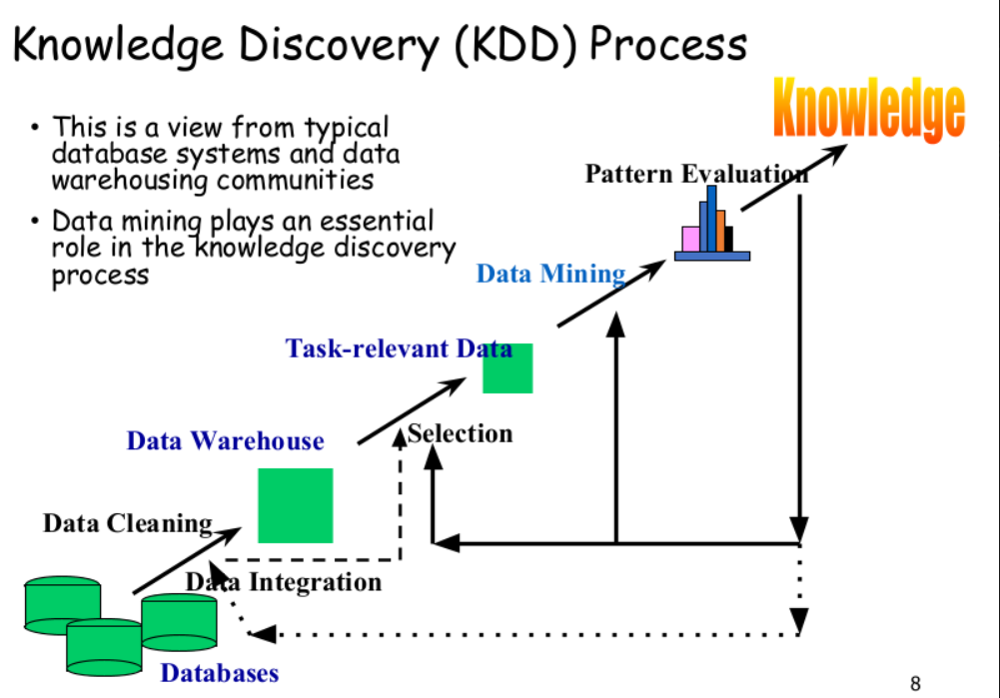

# Chapter 1 - Intro to Data Mining
### Why Data Mining?
> 1. More and more data generated now from
> - business
> - science
> -social media
>
> 2. Need knowledge from data

### What is Data Mining?
> Extraction of interesting <u>unknown</u> pattern or knowledge from huge amount of data
> s
> Alternative names:
> - knowledge discovery
> - data / pattern analysis

### Knowledge Discovery (KDD) Process
>

### Web Mining Framework
> - Data cleaning
> - Data integration (from multiple sources)
> - Data warehousing
> - Data cube construction
> - Data selection (for data mining)
> - Data mining
> - Presentation (of results)
> - Pattern and knowledge store into knowledge-base

### Data mining techniques
> - Data warehouse (OLAP)
> - Machine learning
> - statistics

### What kind of data can be mined
> Data warehouse
> Relational database
> Sensor data
> Time-series data

### Data mining functions
> 1. **Classification:** label prediction based on training data, supervised learning
> 2. **Cluster Analysis:** group data to form new categories, unsupervised learning
> 3. Outlier Analysis: find data object that do not comply with general behavior, useful for fraud detection

### Technologies used / disciplines
> 1. Pattern recognition
> 2. Statistics
> 3. Algorithm
> 4. Machine Learning
> 5. Database Technology

### Where Data Mining is applied?
> 1. Web PageRank
> 2. Medical data analysis (ex. risk of cancer)
> 3. Biological (ex. DNA correlation between 2 people)

### Major issues in data mining
> 1. **Efficiency & scalability:** resource to run data mining algorithms
> 2. **Diverse types of data:** handle complex types of data
> 3. **Social impact:** no privacy & consent before mining on people's data

### KDD Process:
> 1. Data cleaning
> 2. Data integration
> 3. Data selection
> 4. Transformation
> 5. Data mining
> 6. Pattern evaluation
> 7. Knowledge presentation
